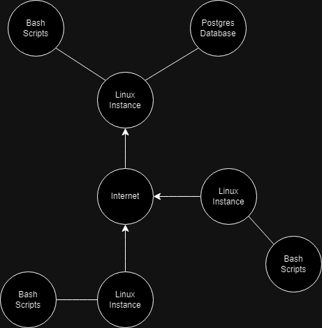

# Linux Cluster Monitoring Agent

# Introduction
This project contains a series of bash scripts which will be used by users wishing to track cpu, disk, and memory usage for performance purposes. These stats are pulled using various commands such as lscpu, vmstat, and df. The stats are isolated using regular expressions, and then will be stored in a postgress SQL database within a docker container. Using crontab, these statistics can be pulled and stored by the minute. Using git, changes are committed and pushed to the repository, keeping track of any updates. The project was created and tested on a Rocky Linux virtual machine hosted on the Google Cloud Platform (GCP).

# Quick start
- First, a psql instance is started using ./scripts/psql_docker.sh
```bash
# create a psql database with the given username and password in a docker container
psql_docker.sh create host_agent password

# start the docker container
psql_docker.sh start
```
- Then, tables will be created using ./sql/ddl.sql
```bash
EXPORT PGPASSWORD='password'
psql -h localhost -U postgres -d host_agent -f sql/ddl.sql
```
- Hardware specs can then be inserted into the database using ./scripts/host_info.sh
```bash
host_info.sh localhost 5432 host_agent postgres password
```
- After hardware specs are inserted, hardware usage data can be inserted into the database using ./scripts/host_usage.sh
```bash
host_usage.sh localhost 5432 host_agent postgres password
```
- To have this automated, crontab can be used. To track usage stats every minute, you can use:
```bash
* * * * * bash host_usage.sh localhost 5432 host_agent postgres password > /tmp/host_usage.log

```

# Implementation
## Architecture


## Scripts
- psql_docker.sh: A script which creates a psql instance within a docker container
```bash
# create a psql database with the given username and password in a docker container
psql_docker.sh create db_username db_password

# start the docker container
psql_docker.sh start

# stop the docker container
psql_docker.sh stop
```
- host_info.sh: A script which collects the hardware specs/information and saves them into the host_info table within the psql database
```bash
# save this computer's specs to the host_info table in the given database
host_info.sh psql_host psql_port db_name psql_user psql_password
```
- host_usage.sh: A script which collects the hardware usage and saves it to the host_usage table within the psql database
```bash
# save this computer's usage data to the host_usage table in the given database
host_usage.sh psql_host psql_port db_name psql_user psql_password
```
- crontab: An automation tool. You can automate the host_usage.sh to periodically collect usage data. Take the following:
```
* * * * * bash host_usage.sh localhost 5432 host_agent postgres password > path_to_log
```

## Database Modeling
- 'host_info'
| Column           | Data Type   | Constraints                            | Description                  |
|------------------|-------------|----------------------------------------|------------------------------|
| id               | SERIAL      | PRIMARY KEY, NOT NULL                  | Automatically incremented ID |
| hostname         | VARCHAR     | UNIQUE, NOT NULL                       | Unique identifier for each host |
| cpu_number       | INT2        | NOT NULL                               | Number of CPUs               |
| cpu_architecture | VARCHAR     | NOT NULL                               | CPU architecture type        |
| cpu_model        | VARCHAR     | NOT NULL                               | Model name of the CPU        |
| cpu_mhz          | FLOAT8      | NOT NULL                               | CPU speed in MHz             |
| l2_cache         | INT4        | NOT NULL                               | Size of L2 cache in KB       |
| timestamp        | TIMESTAMP   | NULL                                   | Timestamp of the record      |
| total_mem        | INT4        | NULL                                   | Total memory in MB           |
### Constraints
  - **Primary Key**: `host_info_pk`
    - Enforces unique identifier for each record based on `id`
  - **Unique Constraint**: `host_info_un`
    - Ensures that `hostname` is unique across the table
- host_usage.sh
| Column           | Data Type   | Constraints                            | Description                       |
|------------------|-------------|----------------------------------------|-----------------------------------|
| timestamp        | TIMESTAMP   | NOT NULL                               | Timestamp of the record           |
| host_id          | SERIAL      | NOT NULL, FOREIGN KEY (host_id) REFERENCES host_info(id) | Reference to `host_info` table   |
| memory_free      | INT4        | NOT NULL                               | Amount of free memory in MB       |
| cpu_idle         | INT2        | NOT NULL                               | CPU idle time percentage          |
| cpu_kernel       | INT2        | NOT NULL                               | CPU time spent in kernel mode     |
| disk_io          | INT4        | NOT NULL                               | Disk I/O operations               |
| disk_available   | INT4        | NOT NULL                               | Available disk space in MB        |
  - **Foreign Key**: `host_usage_host_info_fk`
    - Ensures `host_id` references a valid `id` in the `host_info` table


# Test
Bash scripts were tested by checking the psql tables after using the scripts. Changes were only pushed to git when errors to do with inserting were resolved, and all numbers inserted were verified.

# Deployment
The psql instance was containerized within docker, and was automated on my Rocky linux instance using crontab. All scripts are published and available on GitHub.

#Improvements
- Collect CPU usage frequency information
- Collect data on each CPU core rather than altogether, as well as different disks in the case of multiple disks
- Handle errors in the case that the tables don't exist in host_info.sh and host_usage.sh
